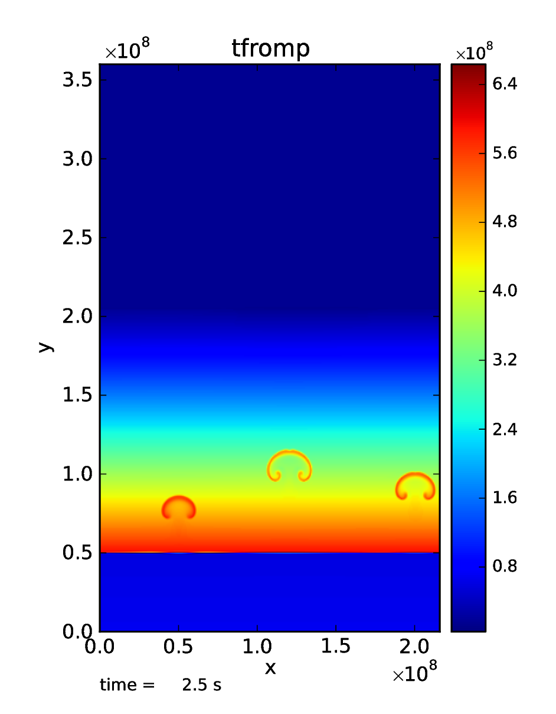

***************
Getting Started
***************

In this chapter we give an overview of MAESTROeX, including some of the
standard problems, how to run the code, some basic runtime parameters,
and how to look at the output.

Requirements
============

MAESTROeX requires a C++ compiler that supports the C++17 standard, a
Fortran compiler that supports the Fortran 2003 standard, and a C compiler
that supports the C99 standard. Several compiler suites are supported,
including GNU, Intel, PGI and Cray. GNU Make (>= 3.82) is also required,
as is Python (>= 3.6) and standard tools available in any Unix-like
environments (e.g., Perl and ``sed``).

For running in parallel, an MPI library and/or OpenMP is required.
For running on GPUs, CUDA 11 or later is required (see :ref:`sec:gpu` for
more information).

Quick Start
===========

Here we will run the standard reacting_bubble problem (three
reacting bubbles in a plane-parallel stratified atmosphere) on a
single processor [1]_. This test problem was shown in
paper 3.

#. *Get a copy of MAESTROeX*.

   If you don’t already have a copy of MAESTROeX, you can obtain one
   from the project’s github page:
   https://github.com/AMReX-Astro/MAESTROeX  . There are several
   options: you can fork it directly on github (recommended if
   you intend to develop the code) or clone it using git from the
   project page by typing::

      git clone https://github.com/AMReX-Astro/MAESTROeX.git

   MAESTROeX is under active development, so you will want to keep in
   sync with the changes by periodically pulling from the repository.
   Simply type::

       git pull

   in the ``MAESTROeX/`` directory.

#. *Get a copy of Microphysics*.

   MAESTROeX and its compressible counterpart CASTRO share a
   common-set of microphysics solvers (nuclear reaction networks and
   equations of state). These are kept in a separate repo.
   There are two ways to access the Microphysics repo: you can use a
   submodule or clone the Microphysics repo itself.

   If you choose to use the submodule, enter the ``MAESTROeX/``
   directory and type::

      git submodule init

   Note that in the future when you pull MAESTROeX, to make sure the
   Microphysics submodule is also updated you must instead use::

      git pull --recurse-submodules

   Alternatively, you can run the following command on your system to
   ensure that updating the submodules upon a git pull is the default
   behavior::

     git config --global submodule.recurse true

   If you choose to use the Microphysics repo directly, it is
   available on github and can be obtained via::

       git clone https://github.com/AMReX-Astro/Microphysics.git

   Next you must specify the path to the Microphysics repository as
   a global environment variable on your machine, ``MICROPHYSICS_HOME``

   You will periodic want to update Microphysics by doing::

       git pull

   in the ``Microphysics/`` directory.

#. *Get a copy of AMReX*.

   MAESTROeX requires the AMReX library to manage the grids and
   parallelization. We also rely on the build system in AMReX to
   build a MAESTROeX executable. AMReX is also available on github
   and can be obtained via::

       git clone https://github.com/AMReX-Codes/amrex.git

   You will periodic want to update AMReX by doing::

       git pull

   in the ``amrex/`` directory.

#. *Setup your shell environment*.

   MAESTROeX needs to know where to find AMReX, by specifying the
   ``AMREX_HOME`` environment variable, and where to find
   Microphysics, by specifying the ``MICROPHYSICS_HOME`` environment
   variable.

   If your shell is Bash, add::

       export AMREX_HOME="/path/to/amrex/"
       export MICROPHYSICS_HOME="/path/to/Microphysics/"

   to your ``.bashrc``.

   If your shell is Csh/Tcsh, add::

       setenv AMREX_HOME /path/to/amrex/
       setenv MICROPHYSICS_HOME /path/to/Microphysics/

   to your ``.cshrc``.

   Note: you must specify the full path to the ``amrex/`` and
   ``Microphysics/`` directory. Do not use “:math:`\sim`” to refer to your
   home directory—the scripts used by the build system will not be
   able to process this.

#. *Setup the problem’s GNUmakefile*.

   In MAESTROeX, each problem lives under one of three sub-directories
   of ``MAESTROeX/Exec/``: ``SCIENCE/``, ``TEST_PROBLEMS/``, or
   ``UNIT_TESTS/``. This problem sub-directory will contain any
   problem-specific files as well as the ``GNUmakefile`` that
   specifies how to build the executable. Note: we rely on features of
   GNU make. Full details of the ``GNUmakefile`` can be found in §
   :ref:`sec:adding_problems`. Here we will
   configure for a serial build.

   Change directory to
   ``MAESTROeX/Exec/TEST_PROBLEMS/reacting_bubble/``.
   We only need to worry about the options at the very top of the
   GNUmakefile for now. These should be set as follows:

   -  ``DEBUG := TRUE``

      This option determines whether we compile with support for
      less-optimized code with debugging runtime checks. Setting
      ``DEBUG := FALSE`` turns off debugging.

   -  ``DIM := 2``

      The dimensionality of the problem must be specified at compile-time.

   -  ``COMP := gnu``

      This option specifies the gnu compiler suite (g++/gfortran).
      We will use gnu, which is the preferred compiler suite for MAESTROeX.
      Specifying this compiler will automatically pull in the compiler
      settings as specified in ``AMREX_HOME/Tools/GNUMake/Make.defs``.
      (Alternate compiler choices include
      ``intel``, ``cray``, and ``pgi``.

   -  ``USE_MPI := TRUE``

      This determines whether we are doing a parallel build, using the
      Message Passing Interface (MPI) library. If you set this option
      to FALSE, you will disable MPI and will build MAESTROeX in
      serial mode, so no MPI library needs to be present on the host
      system.

   -  ``USE_OMP := FALSE``

      This determines whether we are using OpenMP to do parallelism
      within a shared memory node. OpenMP is used together with MPI,
      with MPI distributing the grids across the processors and within a
      shared-memory node, OpenMP allows many cores to operate on the
      same grid. For now, we leave this option as FALSE, disabling OpenMP.

   -  ``USE_REACT := TRUE``

      Some test problems in MAESTROeX do not use reactions, so there is an
      option to disable the compilation of reaction-specific source code.

   -  ``TINY_PROFILE := FALSE``

      Profiling tool that generates a text file with profiling information.
      Refer to the AMReX User’s Guide at
      https://amrex-codes.github.io/amrex/

   -  ``PROFILE := FALSE``

      More advanced profiling tool that generates a text file with
      profiling information, or data files that can be interpreted
      with a special build of amrvis. Selecting TRUE overrides the
      ``TINY_PROFILE setting``.  Refer to the AMReX User’s Guide at
      https://amrex-codes.github.io/amrex/

#. *Build the executable*.

   Type ``make``. The build system will first find the dependencies
   amongst all the source files and then build the executable. When
   finished, the executable will have a name like
   ``Maestro2d.gnu.DEBUG.MPI.ex``, where the specific parts of the name
   depend on the options used in ``GNUmakefile``.

   Note, at the end of the build process, a link will be made in the
   current directory to the data table needed for the equation of state
   (``Microphysics/EOS/helmholtz/helm_table.dat``).

#. *Run!*

   Each problem requires an input file. The inputs file consists of
   lines of the form *parameter = value*, where *parameter* is one of
   the many runtime parameters MAESTROeX knows, and *value* overrides
   the default value for that parameter. For the ``reacting_bubble``
   problem, we will use the inputs file ``inputs_2d_C``. An overview
   of some of the more common runtime parameters is given in § \ `5
   <#sec:gettingstarted:runtime>`__, and a full list of all
   MAESTROeX runtime parameters and their default values is given in
   Chapter :ref:`sec:runtime_parameters`.

   MAESTROeX is run simply as::

         ./Maestro2d.gnu.DEBUG.MPI.ex inputs_2d_C

   or to run in parallel on a local workstation::

         mpiexec -n 4 ./Maestro2d.gnu.DEBUG.MPI.ex inputs_2d_C

   We can also override the default value of any runtime parameter by
   specifying it on the commandline as, e.g.,::

         ./Maestro2d.gnu.DEBUG.MPI.ex inputs_2d_C maestro.max_step=0 amr.n_cell=192 320

   As the code runs, a lot of information will pass through the
   screen.  For each timestep, each of the steps 1 through 12 shown in
   the MAESTROeX flowchart (Chapter :ref:`ch:flowchart`) will be shown along with diagnostic information
   about the solution. Upon completion some memory usage information
   is printed.

#. *Examine the output*.

   As the code runs, it will output both plotfiles and checkpoints as
   well as one or more text diagnostic files (this is currently only
   implemented for spherical problems)
   with integral or extrema information (like maximum Mach number)
   from each timestep.

   By default, the plotfiles will be named plt\ *nnnnnnn*, where
   the number *nnnnnnn* is the timestep number when the file was
   outputted. Similarly, the checkpoints are named
   chk\ *nnnnnnn*. AMReX plotfiles and checkpoints are actually
   directories, with the data stored in sub-directories grouped by
   refinement level. Details of the simulation (build information,
   number of processors used, output date, output directory, runtime
   parameter values, ...) are stored in the plaintext ``job_info``
   file in each plotfile and checkpoint directory.

   .. note:: unless otherwise specified all quantities in
      MAESTROeX are assumed to be in CGS units.

   Visualization of results is described in the next section.

Working with the Output
=======================

Visualization and analysis are done on the plotfiles. A number of
in-house and externally developed tools can work with AMReX-formatted
plotfiles [2]_.
An example plot of the ``reacting_bubble`` problem run above is
shown in the figure below:

   Visualization of the final output of the reacting_bubble problem
   showing the temperature field (as derived from the pressure). This
   plot was done with the AmrPostprocessing tools.

Amrvis
------

Amrvis is an easy-to-use visualization tool developed at LBL for
2- and 3D datasets which can plot slices through 3D datasets as well
as volume-renderings. It can also very easily extract 1D lines
through the dataset along any coordinate direction. It is distributed
separately from the MAESTROeX distribution.

Amrvis can be obtained via git from github as::

    git clone https://github.com/AMReX-Codes/Amrvis.git

Also, to build a 3D version of Amrvis you need to obtain volpack using::

    git clone https://ccse.lbl.gov/pub/Downloads/volpack.git

Amrvis uses the Motif library for defining the GUI. On a Linux
system, you may need to install the lesstif package and any
related development packages (e.g. lesstif-devel). Depending
on your Linux system, you may also need to install libXpm and
related development packages (e.g. libXpm-devel).

AmrPostprocessing scripts
-------------------------

Several useful analysis scripts (written in Fortran 90) can be found
in ``amrex/Tools/Postprocessing/F_Src/``.  The ``GNUmakefile`` there
needs to be edited to indicate which of the tools to build. For
example, to extract the density along a line from the center of a
plotfile, ``plt00200``, in the :math:`y`-direction::

    fextract.Linux.gfortran.exe -d 2 -v "density" -p plt00200

These routines are described in § :ref:`sec:analysis`.

There is also a python visualization method in
``AmrPostprocessing/python``. This is described
in § :ref:`sec:vis:python`.

VisIt
-----

VisIt is a DOE-supported visualization tool for 2- and 3D datasets. It
can do contouring, volume rendering, streamlines, ...  , directly from
AMReX plotfiles. Details on VisIt can be found at:
https://wci.llnl.gov/codes/visit/home.html .  The easiest way to get
started with VisIt is to download a precompiled binary from the VisIt
webpage.

Once VisIt is installed, you can open a AMReX plotfile by pointing
VisIt to the Header file in the plotfile directory.

yt
--

yt (version 3.0 and later) can natively read the MAESTROeX plotfiles. See
the yt documentation or § :ref:`sec:vis_yt`.

Diagnostic Files
----------------

By default, MAESTROeX outputs global diagnostics each timestep into 3
files called ``diag_vel.out``, ``diag_temp.out``, and ``diag_enuc.out``
for spherical problems (ex. ``wdconvect``).
These include various properties such as the maximum Mach number,
peak temperature, and peak nuclear energy generation rate, respectively.
Individual problems can provide their own ``diag.F90`` file to
produce custom diagnostic output. This information can be plotted
directly with GNUplot, for example.

Development Model
=================

When you clone MAESTROeX from github, you will be on the main
branch of the repo. New changes to MAESTROeX are first introduced
into the development branch in the MAESTROeX git repository.
Nightly regression tests are run on development to ensure that
our answers don’t change. Around the first work day of each month, we
merge from development :math:`\rightarrow` main (assuming
tests pass) and tag the state of the code with a date-based tag
YY-MM. We do this on all the other repos in the AMReX-ecosystem,
including amrex/, Microphysics/, and Castro/.

If you want to contribute to MAESTROeX’s development, issue a pull-request
through GitHub from your fork of MAESTROeX and target the development
branch. (If you mistakenly target main, we can change it for you.)

Parallel Jobs
=============

To run in parallel with MPI, you would set ``USE_MPI := TRUE`` in your
GNUmakefile. For a machine with working MPI compiler wrappers
(mpif90 and mpicc), the build system should find these and
compile with MPI support automatically. This is the easiest way to do
a parallel build, and should work on most Linux systems.

More generally, the build system needs to know about your MPI
installation. For popular national computing facilities, this is
already setup, and the build system looks at the machine hostname to
set the proper libraries. For other machines, you may need to edit
the GMake.MPI file in the AMReX build files. See
§ :ref:`ch:make` for more details.

OpenMP can be used to parallelize on shared-memory machines
(i.e. within a node). OpenMP support is accomplished through the
compiler.  Setting::

    USE_OMP = TRUE

in the ``GNUmakefile`` will enable the proper compiler flags to build
with OpenMP. Note: not all MAESTROeX modules have OpenMP support.

.. [1]
   In earlier versions of MAESTROeX this
   problem was called test2

.. [2]
   The plotfiles are in the same format as those made
   by the BoxLib library upon which MAESTROeX was previously based.
