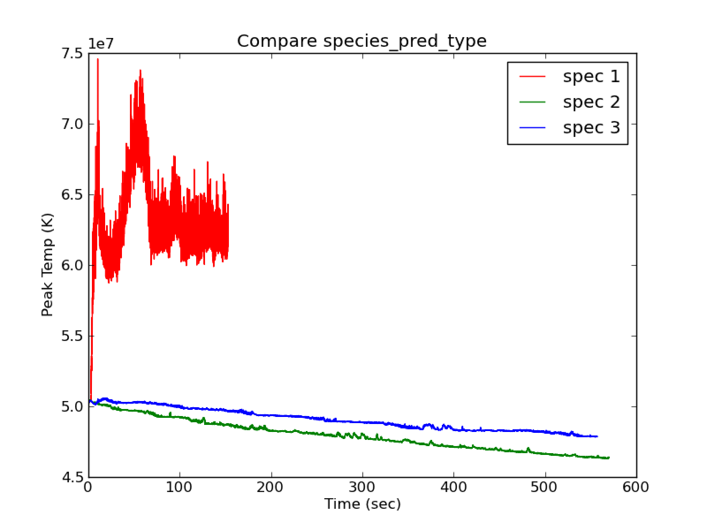
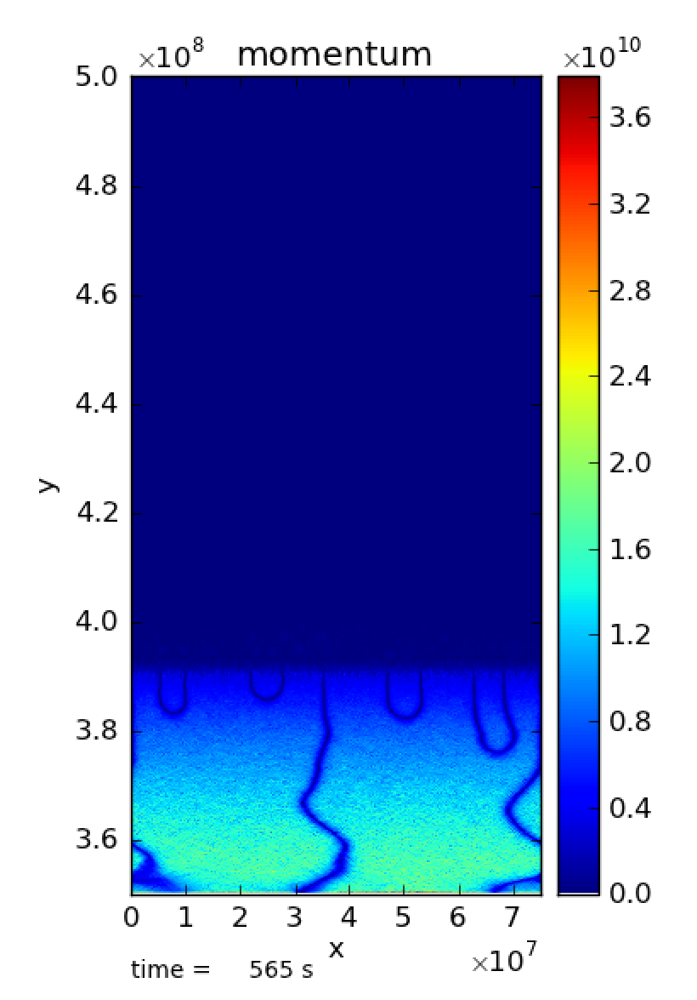
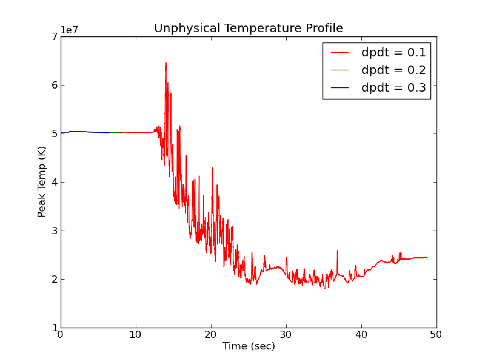
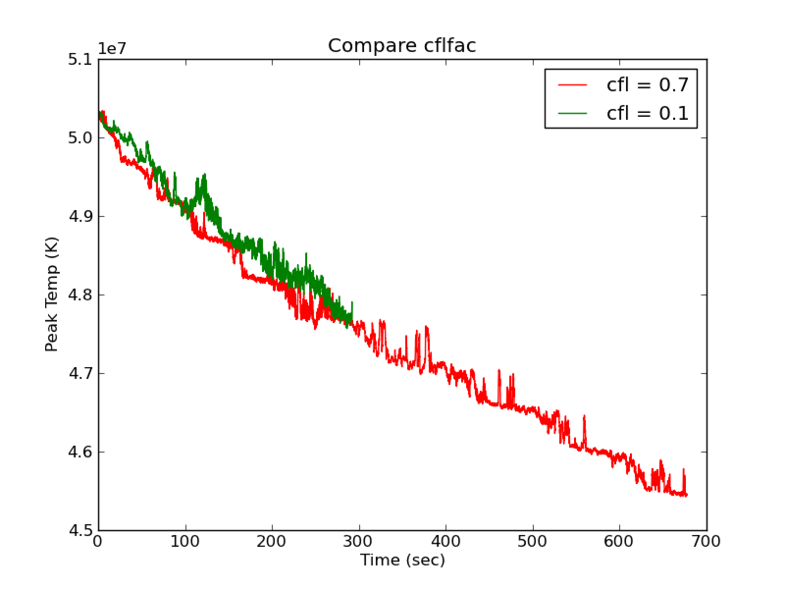
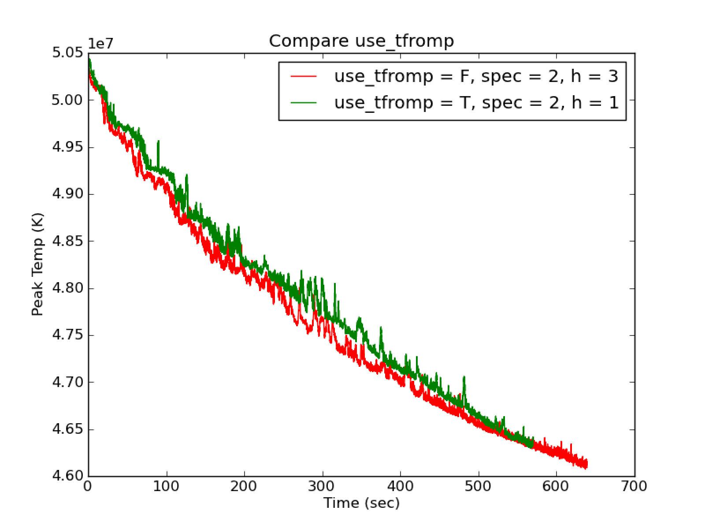
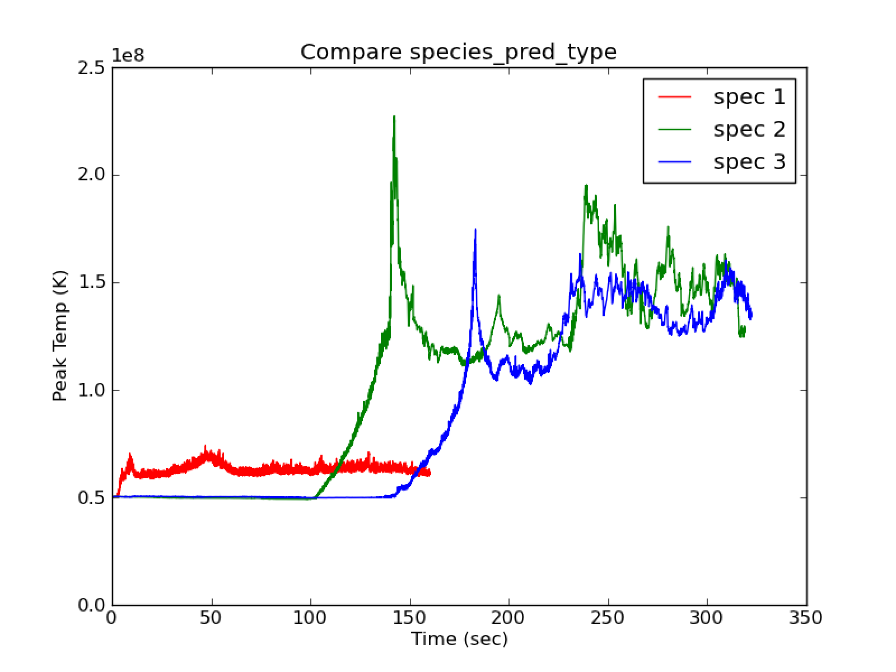

.. _ch:pert:

***********************
Interface State Details
***********************

Predicting interface states
===========================

The MAESTROeX hyperbolic equations come in two forms: advective and
conservative. The procedure for predicting interface states differs
slightly depending on which form we are dealing with.

Advective form
--------------

Most of the time, we are dealing with equations in advective form.
Here, a scalar, :math:`\phi`, obeys:

.. math:: \frac{\partial \phi}{\partial t} = -\Ub \cdot \nabla \phi + f

where :math:`f` is the force. This is the form that the perturbation
equations take, as well as the equation for :math:`X_k` itself.

A piecewise linear prediction of :math:`\phi` to the interface
would appear as:

.. math::

   \begin{aligned}
   \phi_{i+1/2,j}^{n+1/2} &=& \phi_{i,j}^n
       + \left . \frac{\Delta x}{2} \frac{\partial \phi}{\partial x} \right |_{i,j}
       + \left . \frac{\Delta t}{2} \frac{\partial \phi}{\partial t} \right |_{i,j} \\
    &=& \phi_{i,j}^n
       + \left . \frac{\Delta x}{2} \frac{\partial \phi}{\partial x} \right |_{i,j}
       +  \frac{\Delta t}{2} \left ( -u \frac{\partial \phi}{\partial x}
                                            -v \frac{\partial \phi}{\partial y} + f \right ) \\
    &=& \phi_{i,j}^n + \frac{\Delta x}{2} \left ( 1 - \frac{\Delta t}{\Delta x} u \right )
              \frac{\partial \phi}{\partial x}
       \underbrace{- \frac{\Delta t}{2} v \frac{\partial \phi}{\partial y}}_{\text{``transverse~term''}} + \frac{\Delta t}{2} f\end{aligned}

(see the Godunov notes section for more details). Here, the
“transverse term” is accounted for in ``make_edge_scal``. Any
additional forces should be added to :math:`f`. For the perturbation form
of equations, we add additional advection-like terms to :math:`f` by calling
``modify_scal_force``. This will be noted below.

Conservative form
-----------------

A conservative equation takes the form:

.. math:: \frac{\partial \phi}{\partial t} = -\nabla \cdot ( \phi \Ub) + f

Now a piecewise linear prediction of :math:`\phi` to the interface is

.. math::

   \begin{aligned}
   \phi_{i+1/2,j}^{n+1/2} &=& \phi_{i,j}^n
       + \left . \frac{\Delta x}{2} \frac{\partial \phi}{\partial x} \right |_{i,j}
       + \left . \frac{\Delta t}{2} \frac{\partial \phi}{\partial t} \right |_{i,j} \\
    &=& \phi_{i,j}^n
       + \left . \frac{\Delta x}{2} \frac{\partial \phi}{\partial x} \right |_{i,j}
       +  \frac{\Delta t}{2} \left ( -\frac{\partial (\phi u)}{\partial x}
                                     -\frac{\partial (\phi v)}{\partial y} + f \right ) \\
    &=& \phi_{i,j}^n + \frac{\Delta x}{2} \left ( 1 - \frac{\Delta t}{\Delta x} u \right )
              \frac{\partial \phi}{\partial x}
       \underbrace{- \frac{\Delta t}{2} \phi \frac{\partial u}{\partial x} }_{\text{``non-advective~term''}}
                   \underbrace{- \frac{\Delta t}{2} \frac{\partial (\phi v)}{\partial y}}_{\text{``transverse~term''}} + \frac{\Delta t}{2} f\end{aligned}

Here the “transverse term” is now in conservative form, and an additional
term, the non-advective portion of the
:math:`x`-flux (for the :math:`x`-prediction) appears. Both of the underbraced terms are
accounted for in ``make_edge_scal`` automatically when we call it
with ``is_conservative = .true.``.

.. _sec:pred:density:

Density Evolution
=================

Basic equations
---------------

The full density evolution equation is

.. math::
   \begin{aligned}
   \frac{\partial\rho}{\partial t} &=& -\nabla\cdot(\rho\Ub) \nonumber \\
   &=& -\Ub\cdot\nabla\rho - \rho\nabla\cdot\Ub \, .
   \end{aligned}
   :label: rho equation

The species are evolved according to

.. math::
   \begin{aligned}
   \frac{\partial(\rho X_k)}{\partial t} &=& -\nabla\cdot(\rho\Ub X_k) + \rho \omegadot_k \nonumber \\
   &=& -\Ub\cdot\nabla(\rho X_k) - \rho X_k \nabla\cdot\Ub + \rho \omegadot_k \, .
   \end{aligned}
   :label: species equation

In practice, only the species evolution equation is evolved, and the
total density is set as

.. math:: \rho = \sum_k (\rho X_k)

To advance :math:`(\rho X_k)` to the next timestep, we need to predict a
time-centered, interface state. Algebraically, there are multiple
paths to get this interface state—we can predict :math:`(\rho X)` to the
edges as a single quantity, or predict :math:`\rho` and :math:`X` separately
(either in full or perturbation form). In the notes below, we use the
subscript ‘edge’ to indicate what quantity was *predicted* to the
edges. In MAESTROeX, the different methods of computing :math:`(\rho X)` on
edges are controlled by the ``species_pred_type parameter``. The
quantities predicted to edges and the
resulting edge state are shown in the :numref:`table:pred:species`.

.. _table:pred:species:
.. table:: Summary of species edge state construction

   +---------------------------------+---------------------------------------+---------------------------------------------------------------------------------------------+
   | ``species_pred_type``           | quantities predicted                  | :math:`(\rho X_k)`                                                                          |
   |                                 | in ``make_edge_scal``                 | edge state                                                                                  |
   +---------------------------------+---------------------------------------+---------------------------------------------------------------------------------------------+
   | 1 / ``predict_rhoprime_and_X``  | :math:`\rho'_\mathrm{edge}`,          | :math:`\left(\rho_0^{n+\myhalf,{\rm avg}} + \rho'_\mathrm{edge} \right)(X_k)_\mathrm{edge}` |
   |                                 | :math:`(X_k)_\mathrm{edge}`           |                                                                                             |
   +---------------------------------+---------------------------------------+---------------------------------------------------------------------------------------------+
   | 2 / ``predict_rhoX``            | :math:`\sum(\rho X_k)_\mathrm{edge}`, | :math:`(\rho X_k)_\mathrm{edge}`                                                            |
   |                                 | :math:`(\rho X_k)_\mathrm{edge}`      |                                                                                             |
   +---------------------------------+---------------------------------------+---------------------------------------------------------------------------------------------+
   | 3 / ``predict_rho_and_X``       | :math:`\rho_\mathrm{edge}`,           | :math:`\rho_\mathrm{edge} (X_k)_\mathrm{edge}`                                              |
   |                                 | :math:`(X_k)_\mathrm{edge}`           |                                                                                             |
   +---------------------------------+---------------------------------------+---------------------------------------------------------------------------------------------+

We note the labels ``predict_rhoprime_and_X``, ``predict_rhoX``, and
``predict_rho_and_X`` are provided by the ``pred_parameters``
module.

Method 1: species_pred_type = predict_rhoprime_and_X
----------------------------------------------------

Here we wish to construct :math:`(\rho_0^{n+\myhalf,{\rm avg}}
+ \rho'_\mathrm{edge})(X_k)_\mathrm{edge}`.

We predict both :math:`\rho'` and :math:`\rho_0` to edges separately and later use them to
reconstruct :math:`\rho` at edges. The base state density evolution equation is

.. math::
   \frac{\partial\rho_0}{\partial t} = -\nabla\cdot(\rho_0 w_0 \eb_r) =
   -w_0\frac{\partial\rho_0}{\partial r}
   \underbrace{-\rho_0\frac{\partial w_0}{\partial r}}_{``\rho_0 ~ \text{force"}}.
   :label: rho0 equation

Subtract :eq:`rho0 equation` from :eq:`rho equation` and rearrange
terms, noting that :math:`\Ub = \Ubt + w_o\eb_r`, to obtain the
perturbational density equation,

.. math::
   \frac{\partial\rho'}{\partial t} = -\Ub\cdot\nabla\rho' \underbrace{- \rho'\nabla\cdot\Ub
   - \nabla\cdot(\rho_0\Ubt)}_{\rho' ~ \text{force}} \, .
   :label: rhoprime equation

We also need :math:`X_k` at the edges. Here, we subtract :math:`X_k \times`
:eq:`rho equation` from :eq:`species equation` to obtain

.. math:: \frac{\partial X_k}{\partial t} = -\Ub \cdot \nabla X_k + \omegadot_k

When using Strang-splitting, we ignore the :math:`\omegadot_k` source terms, and
then the species equation is a pure advection equation with no force.

Predicting :math:`\rho'` at edges
~~~~~~~~~~~~~~~~~~~~~~~~~~~~~~~~~

We define :math:`\rho' = \rho^{(1)} - \rho_0^n`. Then we predict :math:`\rho'` to
edges using ``make_edge_scal`` in ``density_advance`` and the
underbraced term in :eq:`rhoprime equation` as the forcing. This
force is computed in ``modify_scal_force``. This prediction is
done in advective form.

.. _Predicting rho0 at edges:

Predicting :math:`\rho_0` at edges
~~~~~~~~~~~~~~~~~~~~~~~~~~~~~~~~~~

There are two ways to predict :math:`\rho_0` at edges.

#. We call make_edge_state_1d using the underbraced term
   in :eq:`rho0 equation` as the forcing. This gives us
   :math:`\rho_0^{n+\myhalf,{\rm pred}}`. This term is used to advect :math:`\rho_0`
   in **Advect Base Density**. In plane-parallel geometries, we also use
   :math:`\rho_0^{n+\myhalf,{\rm pred}}` to compute :math:`\etarho`, which will be used
   to compute :math:`\psi`.

#. We define :math:`\rho_0^{n+\myhalf,{\rm avg}} = (\rho_0^n +
   \rho_0^{(2)})/2`. We compute :math:`\rho_0^{(2)}` from :math:`\rho_0^n` using
   **Advect Base Density**, which advances :eq:`rho0 equation`
   through :math:`\Delta t` in time. The :math:`(2)` in the superscript indicates
   that we have not called **Correct Base** yet, which computes
   :math:`\rho_0^{n+1}` from :math:`\rho_0^{(2)}`. We use :math:`\rho_0^{(2)}` rather than
   :math:`\rho_0^{n+1}` to construct :math:`\rho_0^{n+\myhalf,{\rm avg}}` since :math:`\rho_0^{n+1}`
   is not available yet. :math:`\rho_0^{n+\myhalf,{\rm avg}}` is used to construct
   :math:`\rho` at edges from :math:`\rho'` at edges, and
   this :math:`\rho` at edges is used to compute fluxes for :math:`\rho X_k`.

We note that in essence these choices reflect a hyperbolic (1)
vs. elliptic (2) approach. In MAESTROeX, if we setup a problem with
:math:`\rho = \rho_0` initially, and enforce a constraint :math:`\nabla \cdot
(\rho_0 \Ub) = 0` (i.e. the anelastic constraint), then analytically,
we should never generate a :math:`\rho'`. To realize this behavior
numerically, we use :math:`\rho_0^{n+\myhalf,{\rm avg}}` in the prediction
of :math:`(\rho X_k)` on the edges to be consistent with the use of the
average of :math:`\rho` to the interfaces in the projection step at the end
of the algorithm.

.. _Computing rho at edges:

Computing :math:`\rho` at edges
~~~~~~~~~~~~~~~~~~~~~~~~~~~~~~~

For the non-radial edges, we directly add :math:`\rho_0^{n+\myhalf,{\rm avg}}`
to :math:`\rho'` since :math:`\rho_0^{n+\myhalf,{\rm avg}}` is a cell-centered
quantity. For the radial edges, we interpolate to obtain
:math:`\rho_0^{n+\myhalf,{\rm avg}}` at radial edges before adding it to
:math:`\rho'`.

.. _sec:pert:predict_X:

Predicting :math:`X_k` at edges
~~~~~~~~~~~~~~~~~~~~~~~~~~~~~~~

Predicting :math:`X_k` is straightforward. We convert the cell-centered
:math:`(\rho X_k)` to :math:`X_k` by dividing by :math:`\rho` in each zone and then we
just call ``make_edge_scal`` in ``density_advance`` on :math:`X_k`.
The force seen by ``make_edge_scal`` is 0. The prediction is
done in advective form.

Method 2: species_pred_type = predict_rhoX
------------------------------------------

Here we wish to construct :math:`(\rho X_k)_\mathrm{edge}` by predicting
:math:`(\rho X_k)` to the edges as a single quantity. We recall
:eq:`species equation`:

.. math::

   \frac{\partial(\rho X_k)}{\partial t} =
     -\nabla \cdot (\rho \Ub X_k) + \rho \omegadot_k \, . \nonumber

The edge state is created by calling ``make_edge_scal`` in
``density_advance`` with ``is_conservative = .true.``.
We do not consider the :math:`\rho \omegadot_k` term in the forcing when
Strang-splitting.

We note that even though it is not needed here, we still compute
:math:`\rho_\mathrm{edge}=\sum(\rho X_k)_\mathrm{edge}` at the edges since certain
enthalpy formulations need it.

Method 3: species_pred_type = predict_rho_and_X
-----------------------------------------------

Here we wish to construct :math:`\rho_\mathrm{edge} (X_k)_\mathrm{edge}`
by predicting :math:`\rho` and :math:`X_k` to the edges separately.

Predicting :math:`X_k` to the edges proceeds exactly as described in
§ \ `2.2.4 <#sec:pert:predict_X>`__.

Predicting the full :math:`\rho` begins with :eq:`rho equation`:

.. math::
   \frac{\partial\rho}{\partial t}
   = -\Ub\cdot\nabla\rho \, \underbrace{- \rho\nabla\cdot\Ub}_{``\rho~\text{force''}} \, .
   :label: rho equation labeled

Using this, :math:`\rho` is predicted to the edges using
``make_edge_scal`` in ``density_advance``, with the underbraced
force computed in ``modify_scal_force`` with ``fullform =
.true.``.

.. _Advancing rhoX_k:

Advancing :math:`\rho X_k`
--------------------------

The evolution equation for :math:`\rho X_k`, ignoring the reaction
terms that were already accounted for in ``react_state``, and the
associated discretization is:

* ``species_pred_type = predict_rhoprime_and_X`` :

  .. math::

     \frac{\partial\rho X_k}{\partial t} =
     -\nabla\cdot\left\{\left[\left({\rho_0}^{n+\myhalf,{\rm avg}}
     + \rho'_\mathrm{edge} \right)(X_k)_\mathrm{edge} \right](\Ubt+w_0\eb_r)\right\}.

* ``species_pred_type = predict_rhoX`` :

  .. math::

     \frac{\partial\rho X_k}{\partial t} =
     -\nabla\cdot\left\{\left[\left(\rho X_k \right)_\mathrm{edge} \right](\Ubt+w_0\eb_r)\right\}.

* ``species_pred_type = predict_rho_and_X`` :

  .. math::

     \frac{\partial\rho X_k}{\partial t} =
     -\nabla\cdot\left\{\left[\rho_\mathrm{edge} (X_k)_\mathrm{edge} \right](\Ubt+w_0\eb_r)\right\}.

.. _sec:pred:enthalpy:

Energy Evolution
================

.. _basic-equations-1:

Basic equations
---------------

MAESTROeX solves an enthalpy equation.
The full enthalpy equation is

.. math::

   \begin{aligned}
   \frac{\partial(\rho h)}{\partial t} &=& -\nabla\cdot(\rho h \Ub) + \frac{Dp_0}{Dt}
   + \nabla\cdot \kth \nabla T + \rho H_{\rm nuc} + \rho H_{\rm ext} \nonumber \\
   &=& \underbrace{-\Ub\cdot\nabla(\rho h) - \rho h\nabla\cdot\Ub}_{-\nabla\cdot(\rho h\Ub)}
   + \underbrace{\psi + (\Ubt \cdot \er) \frac{\partial p_0}{\partial r}}_{\frac{Dp_0}{Dt}}
   + \nabla\cdot\kth\nabla T + \rho H_{\rm nuc} + \rho H_{\rm ext}.\end{aligned}

Due to Strang-splitting of the reactions, the call to
react_state has already been made. Hence, the goal is to compute
an edge state enthalpy starting from :math:`(\rho h)^{(1)}` using an
enthalpy equation that does not include the :math:`\rho H_{\rm nuc}` and
:math:`\rho H_{\rm ext}` terms, where were already accounted for in
react_state, so our equation becomes

.. math::
   \frac{\partial(\rho h)}{\partial t} = -\Ub\cdot\nabla(\rho h) - \rho h\nabla\cdot\Ub
   + \underbrace{\psi + (\Ubt \cdot \er) \frac{\partial p_0}{\partial r} + \nabla\cdot\kth\nabla T}_{``(\rho h) ~ \text{force}"}
   :label: rhoh equation

We define the base state enthalpy evolution equation as

.. math::
   \begin{aligned}
   \frac{\partial(\rho h)_0}{\partial t} &=& -\nabla\cdot[(\rho h)_0 w_0\eb_r]
   + \frac{D_0p_0}{Dt} \nonumber \\
   &=& -w_0\frac{\partial(\rho h)_0}{\partial r}
   - \underbrace{(\rho h)_0\frac{\partial w_0}{\partial r}+ \psi}_{``(\rho h)_0 ~ \text{force}"}
    .
   \end{aligned}
   :label: rhoh0 equation

Perturbational enthalpy formulation
~~~~~~~~~~~~~~~~~~~~~~~~~~~~~~~~~~~

Subtracting :eq:`rhoh0 equation` from :eq:`rhoh equation` and
rearranging terms gives the perturbational enthalpy equation

.. math::
   \begin{aligned}
   \frac{\partial(\rho h)'}{\partial t} &=& -\nabla\cdot[(\rho h)'\Ub]
   - \nabla\cdot[(\rho h)_0\Ubt] + (\Ubt \cdot \er)\frac{\partial p_0}{\partial r}
   + \nabla\cdot\kth\nabla T\nonumber \\
   &=& -\Ub\cdot\nabla(\rho h)' \underbrace{- (\rho h)'\nabla\cdot\Ub
   - \nabla\cdot[(\rho h)_0\Ubt] + (\Ubt \cdot \er)\frac{\partial p_0}{\partial r}
   + \nabla\cdot\kth\nabla T}_{``(\rho h)' ~ \text{force}"},
   \end{aligned}
   :label: rhohprime equation

Temperature formulation
~~~~~~~~~~~~~~~~~~~~~~~

Alternately, we can consider an temperature evolution equation, derived
from enthalpy, as:

.. math::

   \frac{\partial T}{\partial t} = -\Ub\cdot\nabla T
   + \frac{1}{\rho c_p}\left\{(1-\rho h_p)\left[\psi
   + (\Ubt \cdot \er )\frac{\partial p_0}{\partial r}\right]
   + \nabla \cdot \kth \nabla T
   - \sum_k\rho\xi_k\omegadot_k
   + \rho H_{\rm nuc} + \rho H_{\rm ext}\right\}.

Again, we neglect the reaction terms, since that will be handled during
the reaction step, so we can write this as:

.. math::
   \frac{\partial T}{\partial t} = -\Ub\cdot\nabla T
   \underbrace{
   + \frac{1}{\rho c_p}\left\{(1-\rho h_p)\left[\psi
   + (\Ubt \cdot \er )\frac{\partial p_0}{\partial r}\right]
   + \nabla \cdot \kth \nabla T \right \} }_{``T~\text{force''}} \, .
   :label: T equation labeled

Pure enthalpy formulation
~~~~~~~~~~~~~~~~~~~~~~~~~

A final alternative is to consider an evolution equation for :math:`h`
alone. This can be derived by expanding the derivative of :math:`(\rho h)`
in :eq:`rhoh equation` and subtracting off :math:`h \times` the
continuity equation (:eq:`rho equation`):

.. math::
   \frac{\partial h}{\partial t} = -\Ub \cdot \nabla h
   \underbrace{+ \frac{1}{\rho}
   \left \{ \psi + (\Ubt \cdot \er )\frac{\partial p_0}{\partial r}
   + \nabla \cdot \kth \nabla T \right \} }_{``h~\text{force''}} \, .
   :label: h equation labeled

Prediction requirements
~~~~~~~~~~~~~~~~~~~~~~~

To update the enthalpy, we need to compute an interface state for
:math:`(\rho h)`. As with the species evolution, there are multiple
quantities we can predict to the interfaces to form this state,
controlled by ``enthalpy_pred_type``. A complexity of the
enthalpy evolution is that the formation of this edge state will
depend on ``species_pred_type``.

The general procedure for making the :math:`(\rho h)` edge state is as follows:

#. predict :math:`(\rho h)`, :math:`(\rho h)'`, :math:`h`, or :math:`T`
   to the edges (depending on ``enthalpy_pred_type`` ) using
   ``make_edge_scal`` and the forces identified in the appropriate
   evolution equation (:eq:`rhohprime equation`, :eq:`T equation
   labeled`, or :eq:`h equation labeled` respectively).

   The appropriate forces are summaried in :numref:`table:pred:hforce`.

#. if we predicted :math:`T`, convert this predicted
   edge state to an intermediate “enthalpy” state (the quotes
   indicate that it may be perturbational or full enthalpy) by calling
   the EOS.

#. construct the final enthalpy edge state in ``mkflux``. The
   precise construction depends on what species and enthalpy quantities
   are input to mkflux.

Finally, when MAESTROeX is run with ``use_tfromp = T``, the
temperature is derived from the density, basestate pressure (:math:`p_0`),
and :math:`X_k`. When run with reactions or external heating,
react_state updates the temperature after the reaction/heating
term is computed. In ``use_tfromp = T`` mode, the temperature will
not see the heat release, since the enthalpy does not feed in. Only
after the hydro update does the temperature gain the effects of the
heat release due to the adjustment of the density (which in turn sees
it through the velocity field and :math:`S`). As a result, the
``enthalpy_pred_types`` that predict temperature to the interface
( ``predict_T_then_rhoprime`` and ``predict_T_then_h`` ) will
not work. MAESTROeX will abort if the code is run with this
combination of parameters.

The behavior of ``enthalpy_pred_type`` is:

* ``enthalpy_pred_type = 0`` (``predict_rhoh``) :
  we predict :math:`(\rho h)`.  The advective force is:

  .. math::
     \left [\psi + (\Ubt \cdot  \er)   \frac{\partial p_0}{\partial r} + \nabla \cdot \kth \nabla T \right ]

* ``enthalpy_pred_type = 1`` (``predict_rhohprime``) :
  we predict :math:`(\rho h)^\prime`.  The advective force is:

  .. math::
     -(\rho h)^\prime \; \nabla \cdot (\Ubt+w_0 \er) - \nabla \cdot (\Ubt (\rho h)_0) + (\Ubt \cdot \er) \frac{\partial p_0}{\partial r} + \nabla \cdot \kth \nabla T

* ``enthalpy_pred_type = 2`` (``predict_h``) :
  we predict :math:`h`.  The advective force is:

  .. math::
     \frac{1}{\rho} \left [\psi + (\Ubt \cdot \er) \frac{\partial p_0}{\partial r} + \nabla \cdot \kth \nabla T \right ]

* ``enthalpy_pred_type = 3`` (``predict_T_then_rhohprime``) :
  we predict :math:`T`.  The advective force is:

  .. math::
     \frac{1}{\rho c_p} \left \{ (1 - \rho h_p) \left [\psi + (\Ubt \cdot \er) \frac{\partial p_0}{\partial r} \right ] + \nabla \cdot \kth \nabla T \right \}

* ``enthalpy_pred_type = 4`` (``predict_T_then_h``) :
  we predict :math:`T`.  The advective force is:

  .. math::
     \frac{1}{\rho c_p} \left\{ (1 - \rho h_p) \left [\psi + (\Ubt \cdot \er) \frac{\partial p_0}{\partial r}\right ] +  \nabla \cdot \kth \nabla T \right\}

The combination of ``species_pred_type`` and ``enthalpy_pred_type`` determine how we construct the edge state.  The variations are:

* ``species_pred_type = 1`` (``predict_rhoprime_and_X``) and ``enthalpy_pred_type = 0`` (``predict_rhoh``) :

  * cell-centered quantity predicted in ``make_edge_scal`` : :math:`(\rho h)`

  * intermediate "enthalpy" edge state : :math:`(\rho h)_\mathrm{edge}`

  * species quantity available in ``mkflux`` : :math:`X_\mathrm{edge}`, :math:`\rho'_\mathrm{edge}`

  * final :math:`(\rho h)` edge state : :math:`(\rho h)_\mathrm{edge}`

* ``species_pred_type = 1`` (``predict_rhoprime_and\_X``) and ``enthalpy_pred_type = 1`` (``predict_rhohprime``) :

  * cell-centered quantity predicted in ``make_edge_scal`` : :math:`(\rho h)'`

  * intermediate "enthalpy" edge state : :math:`(\rho h)'_\mathrm{edge}`

  * species quantity available in ``mkflux`` : :math:`X_\mathrm{edge}`, :math:`\rho'_\mathrm{edge}`

  * final :math:`(\rho h)` edge state : :math:`\left [ (\rho h)_0^{n+\myhalf,{\rm avg}} + (\rho h)'_\mathrm{edge} \right ]`

* ``species_pred_type = 1`` (``predict_rhoprime_and_X``) and ``enthalpy_pred_type = 2`` (``predict_h``)

  * cell-centered quantity predicted in ``make_edge_scal`` : :math:`h`

  * intermediate "enthalpy" edge state : :math:`h_\mathrm{edge}`

  * species quantity available in ``mkflux`` : :math:`X_\mathrm{edge}`, :math:`\rho'_\mathrm{edge}`

  * final :math:`(\rho h)` edge state : :math:`\left ( \rho_0^{n+\myhalf,{\rm avg}} + \rho'_\mathrm{edge} \right ) h_\mathrm{edge}`

* ``species_pred_type = 1`` (``predict_rhoprime_and_X``) and ``enthalpy_pred_type = 3`` (``predict_T_then_rhohprime``)

  * cell-centered quantity predicted in ``make_edge_scal`` : :math:`T`

  * intermediate "enthalpy" edge state : :math:`(\rho h)'_\mathrm{edge}`

  * species quantity available in ``mkflux`` : :math:`X_\mathrm{edge}`, :math:`\rho'_\mathrm{edge}`

  * final :math:`(\rho h)` edge state : :math:`\left [ (\rho h)_0^{n+\myhalf,{\rm avg}} + (\rho h)'_\mathrm{edge} \right ]`

* ``species_pred_type = 1`` (``predict_rhoprime_and_X``) and ``enthalpy_pred_type = 4`` {``predict_T_then_h``)

  * cell-centered quantity predicted in ``make_edge_scal`` : :math:`T`

  * intermediate "enthalpy" edge state : :math:`h_\mathrm{edge}`

  * species quantity available in ``mkflux`` : :math:`X_\mathrm{edge}`, :math:`\rho'_\mathrm{edge}`

  * final :math:`(\rho h)` edge state : :math:`\left ( \rho_0^{n+\myhalf,{\rm avg}} + \rho'_\mathrm{edge} \right ) h_\mathrm{edge}`

* ``species_pred_type = 2`` (``predict_rhoX``) and ``enthalpy_pred_type = 0`` (``predict_rhoh``)

  * cell-centered quantity predicted in ``make_edge_scal`` : :math:`(\rho h)`

  * intermediate "enthalpy" edge state : :math:`(\rho h)_\mathrm{edge}`

  * species quantity available in ``mkflux`` : :math:`(\rho X)_\mathrm{edge}`, :math:`\sum(\rho X)_\mathrm{edge}`

  * final :math:`(\rho h)` edge state : :math:`(\rho h)_\mathrm{edge}`

* ``species_pred_type = 2`` (``predict_rhoX``) and ``enthalpy_pred_type = 1`` (``predict_rhohprime``)

  * cell-centered quantity predicted in ``make_edge_scal`` : :math:`(\rho h)'`

  * intermediate "enthalpy" edge state : :math:`(\rho h)'_\mathrm{edge}`

  * species quantity available in ``mkflux`` : :math:`(\rho X)_\mathrm{edge}`, :math:`\sum(\rho X)_\mathrm{edge}`

  * final :math:`(\rho h)` edge state : :math:`\left [ (\rho h)_0^{n+\myhalf,{\rm avg}} + (\rho h)'_\mathrm{edge} \right ]`

* ``species_pred_type = 2`` (``predict_rhoX``) and ``enthalpy_pred_type = 2`` (``predict_h``)

  * cell-centered quantity predicted in ``make_edge_scal`` : :math:`h`

  * intermediate "enthalpy" edge state : :math:`h_\mathrm{edge}`

  * species quantity available in ``mkflux`` : :math:`(\rho X)_\mathrm{edge}`, :math:`\sum(\rho X)_\mathrm{edge}`

  * final :math:`(\rho h)` edge state : :math:`\sum(\rho X)_\mathrm{edge} h_\mathrm{edge}`

* ``species_pred_type = 2`` (``predict_rhoX``) and ``enthalpy_pred_type = 3`` (``predict_T_then_rhohprime``)

  * cell-centered quantity predicted in ``make_edge_scal`` : :math:`T$`

  * intermediate "enthalpy" edge state : :math:`(\rho h)'_\mathrm{edge}`

  * species quantity available in ``mkflux`` : :math:`(\rho X)_\mathrm{edge}`, :math:`\sum(\rho X)_\mathrm{edge}`

  * final :math:`(\rho h)` edge state : :math:`\left [ (\rho h)_0^{n+\myhalf,{\rm avg}} + (\rho h)'_\mathrm{edge} \right ]`

* ``species_pred_type = 2`` (``predict_rhoX``) and ``enthalpy_pred_type = 4`` (``predict_T_then_h``)

  * cell-centered quantity predicted in ``make_edge_scal`` : :math:`T`

  * intermediate "enthalpy" edge state : :math:`h_\mathrm{edge}`

  * species quantity available in ``mkflux`` : :math:`(\rho X)_\mathrm{edge}`, :math:`\sum(\rho X)_\mathrm{edge}`

  * final :math:`(\rho h)` edge state : :math:`\sum(\rho X)_\mathrm{edge} h_\mathrm{edge}`

* ``species_pred_type = 3`` (``predict_rho_and_X``) and ``enthalpy_pred_type = 0`` (``predict_rhoh``)

  * cell-centered quantity predicted in ``make_edge_scal`` : :math:`(\rho h)`

  * intermediate "enthalpy" edge state : :math:`(\rho h)_\mathrm{edge}`

  * species quantity available in ``mkflux`` : :math:`X_\mathrm{edge}`, :math:`\rho_\mathrm{edge}`

  * final :math:`(\rho h)` edge state : :math:`(\rho h)_\mathrm{edge}`

* ``species_pred_type = 3`` (``predict_rho_and_X``) and ``enthalpy_pred_type = 1`` (``predict_rhohprime``)

  * cell-centered quantity predicted in ``make_edge_scal`` : :math:`(\rho h)'`

  * intermediate "enthalpy" edge state : :math:`(\rho h)'_\mathrm{edge}`

  * species quantity available in ``mkflux`` : :math:`X_\mathrm{edge}`, :math:`\rho_\mathrm{edge}`

  * final :math:`(\rho h)` edge state : :math:`\left [ (\rho h)_0^{n+\myhalf,{\rm avg}} + (\rho h)'_\mathrm{edge} \right ]`

* ``species_pred_type = 3`` (``predict_rho_and_X``) and ``enthalpy_pred_type = 2`` (``predict_h``)

  * cell-centered quantity predicted in ``make_edge_scal`` : :math:`h`

  * intermediate "enthalpy" edge state : :math:`h_\mathrm{edge}`

  * species quantity available in ``mkflux`` : :math:`X_\mathrm{edge}`, :math:`\rho_\mathrm{edge}`

  * final :math:`(\rho h)` edge state : :math:`\rho_\mathrm{edge} h_\mathrm{edge}`

* ``species_pred_type = 3`` (``predict_rho_and_X``) and ``enthalpy_pred_type = 3`` (``predict_T_then_rhohprime``)

  * cell-centered quantity predicted in ``make_edge_scal`` : :math:`T`

  * intermediate "enthalpy" edge state : :math:`(\rho h)'_\mathrm{edge}`

  * species quantity available in ``mkflux`` : :math:`X_\mathrm{edge}`, :math:`\rho_\mathrm{edge}`

  * final :math:`(\rho h)` edge state : :math:`\left [ (\rho h)_0^{n+\myhalf,{\rm avg}} + (\rho h)'_\mathrm{edge} \right ]`

* ``species_pred_type = 3`` (``predict_rho_and_X``) and ``enthalpy_pred_type = 4`` (``predict_T_then_h``)

  * cell-centered quantity predicted in ``make_edge_scal`` : :math:`T`

  * intermediate "enthalpy" edge state : :math:`h_\mathrm{edge}`

  * species quantity available in ``mkflux`` : :math:`X_\mathrm{edge}`, :math:`\rho_\mathrm{edge}`

  * final :math:`(\rho h)` edge state : :math:`\rho_\mathrm{edge} h_\mathrm{edge}`

Method 0: enthalpy_pred_type = predict_rhoh
-------------------------------------------

Here we wish to construct :math:`(\rho h)_\mathrm{edge}` by predicting
:math:`(\rho h)` to the edges directly. We use ``make_edge_scal`` with
``is_conservative = .true.`` on :math:`(\rho h)`, with the underbraced term
in :eq:`rhoh equation` as the force (computed in ``mkrhohforce``).

Method 1: enthalpy_pred_type = predict_rhohprime
------------------------------------------------

Here we wish to construct :math:`\left [ (\rho h)_0^{n+\myhalf,{\rm avg}} + (\rho
h)'_\mathrm{edge} \right ]` by predicting :math:`(\rho h)'` to the edges.

.. _Predicting rhohprime at edges:

Predicting :math:`(\rho h)'` at edges
~~~~~~~~~~~~~~~~~~~~~~~~~~~~~~~~~~~~~

We define :math:`(\rho h)' = (\rho h)^{(1)} - (\rho h)_0^n`. Then we predict
:math:`(\rho h)'` to edges using ``make_edge_scal`` in ``enthalpy_advance``
and the underbraced term in :eq:`rhohprime equation` as the forcing (see
also :numref:`table:pred:hforce` for the forcing term).
The first two terms in :math:`(\rho h)'` force are computed in
``modify_scal_force``, and the last two terms are accounted for in
``mkrhohforce``. For spherical problems, we have found that a different
representation of the pressure term in the :math:`(\rho h)'` force gives better
results, namely:

.. math::

   (\Ubt \cdot \er)\frac{\partial p_0}{\partial r} \equiv \Ubt\cdot\nabla p_0 =
   \nabla\cdot(\Ubt p_0) - p_0\nabla\cdot\Ubt.

Predicting :math:`(\rho h)_0` at edges
~~~~~~~~~~~~~~~~~~~~~~~~~~~~~~~~~~~~~~

We use an analogous procedure described in Section :ref:`Predicting
rho0 at edges` for computing :math:`\rho_0^{n+\myhalf,\rm{avg}}` to
obtain :math:`(\rho h)_0^{n+\myhalf,\rm{avg}}`, i.e., :math:`(\rho
h)_0^{n+\myhalf,{\rm avg}} = [(\rho h)_0^{n} + (\rho h)_0^{n+1}]/2`.

For spherical, however, instead of computing :math:`(\rho h)_0` on edges
directly, we compute :math:`\rho_0` and :math:`h_0` separately at the edges, and
multiply to get :math:`(\rho h)_0`.

Computing :math:`\rho h` at edges
~~~~~~~~~~~~~~~~~~~~~~~~~~~~~~~~~

We use an analogous procedure described in Section :ref:`Computing rho
at edges` for computing :math:`\rho` at edges to compute :math:`\rho
h` at edges.

Method 2: enthalpy_pred_type = predict_h
----------------------------------------

Here, the construction of the interface state depends on what species
quantities are present. In all cases, the enthalpy state is found
by predicting :math:`h` to the edges.

For ``species_pred_types``: ``predict_rhoprime_and_X``, we wish to construct
:math:`(\rho_0 + \rho'_\mathrm{edge} ) h_\mathrm{edge}`.

For ``species_pred_types``: ``predict_rho_and_X`` or
``predict_rhoX``, we wish to construct :math:`\rho_\mathrm{edge} h_\mathrm{edge}`.

Predicting :math:`h` at edges
~~~~~~~~~~~~~~~~~~~~~~~~~~~~~

We define :math:`h = (\rho h)^{(1)}/\rho^{(1)}`. Then we predict :math:`h` to edges
using ``make_edge_scal`` in ``enthalpy_advance`` and the
underbraced term in :eq:`h equation labeled` as the forcing (see
also :numref:`table:pred:hforce`. This force is computed by
``mkrhohforce`` and then divided by :math:`\rho`. Note: ``mkrhoforce``
knows about the different ``enthalpy_pred_types`` and computes
the correct force for this type.

.. _computing-rho-h-at-edges-1:

Computing :math:`\rho h` at edges
~~~~~~~~~~~~~~~~~~~~~~~~~~~~~~~~~

| ``species_pred_types``: ``predict_rhoprime_and_X``:
| We use the same procedure described in Section `[Computing rho at
    edges] <#Computing rho at
    edges>`__ for computing :math:`\rho_\mathrm{edge}` from :math:`\rho_0` and
  :math:`\rho'_\mathrm{edge}` and then multiply by :math:`h_\mathrm{edge}`.

|  
| ``species_pred_types``: ``predict_rhoX``:
| We already have :math:`\sum(\rho X_k)_\mathrm{edge}` and simply multiply by
  :math:`h_\mathrm{edge}`.

|  
| ``species_pred_types``: ``predict_rho_and_X``:
| We already have :math:`\rho_\mathrm{edge}` and simply multiply by
  :math:`h_\mathrm{edge}`.

Method 3: enthalpy_pred_type = predict_T_then_rhohprime
-------------------------------------------------------

Here we wish to construct :math:`\left [ (\rho h)_0 + (\rho h)'_\mathrm{edge} \right ]` by predicting :math:`T` to the edges and then
converting this to :math:`(\rho h)'_\mathrm{edge}` via the EOS.

Predicting :math:`T` at edges
~~~~~~~~~~~~~~~~~~~~~~~~~~~~~

We predict :math:`T` to edges using ``make_edge_scal`` in
``enthalpy_advance`` and the underbraced term in Eq. \ `[T equation
  labeled] <#T equation
  labeled>`__ as the forcing (see also :numref:`table:pred:hforce`).
This force is computed by ``mktempforce``.

Converting :math:`T_\mathrm{edge}` to :math:`(\rho h)'_\mathrm{edge}`
~~~~~~~~~~~~~~~~~~~~~~~~~~~~~~~~~~~~~~~~~~~~~~~~~~~~~~~~~~~~~~~~~~~~~

We call the EOS in ``makeHfromRhoT_edge`` (called from
``enthalpy_advance``) to convert from :math:`T_\mathrm{edge}` to :math:`(\rho
h)'_\mathrm{edge}`. For the EOS call, we need :math:`X_\mathrm{edge}` and
:math:`\rho_\mathrm{edge}`. This construction depends on
``species_pred_type``, since the species edge states may differ
between the various prediction types (see the “species quantity”
column in :numref:`table:pred:hoverview`. The EOS inputs are
constructed as:

.. raw:: latex

   \centering

+-----------------------+-----------------------+-----------------------+
| species_pred_type     | :math:`\rho` edge     | :math:`X_k` edge      |
|                       | state                 | state                 |
+=======================+=======================+=======================+
| predict_rhoprime_and_ | :math:`\rho_0^{n+\myh | :math:`(X_k)_\mathrm{ |
| X                     | alf,\rm{avg}} + \rho' | edge}`                |
|                       | _\mathrm{edge}`       |                       |
+-----------------------+-----------------------+-----------------------+
| predict_rhoX          | :math:`\sum_k (\rho X | :math:`(\rho X_k)_\ma |
|                       | _k)_\mathrm{edge}`    | thrm{edge}/\sum_k (\r |
|                       |                       | ho X_k)_\mathrm{edge} |
|                       |                       | `                     |
+-----------------------+-----------------------+-----------------------+
| predict_rho_and_X     | :math:`\rho_\mathrm{e | :math:`(X_k)_\mathrm{ |
|                       | dge}`                 | edge}`                |
+-----------------------+-----------------------+-----------------------+

After calling the EOS, the output of ``makeHfromRhoT_edge`` is
:math:`(\rho h)'_\mathrm{edge}`.

.. _computing-rho-h-at-edges-2:

Computing :math:`\rho h` at edges
~~~~~~~~~~~~~~~~~~~~~~~~~~~~~~~~~

The computation of the final :math:`(\rho h)` edge state is done identically
as the ``predict_rhohprime`` version.

Method 4: enthalpy_pred_type = predict_T_then_h
-----------------------------------------------

Here, the construction of the interface state depends on what species
quantities are present. In all cases, the enthalpy state is found by
predicting :math:`T` to the edges and then converting this to
:math:`h_\mathrm{edge}` via the EOS.

For ``species_pred_types``:`` predict_rhoprime_and_X,`` we wish to
construct :math:`(\rho_0 + \rho'_\mathrm{edge} ) h_\mathrm{edge}`.

For ``species_pred_types``: ``predict_rhoX``, we wish to
construct :math:`\sum(\rho X_k)_\mathrm{edge} h_\mathrm{edge}`.

For ``species_pred_types``: ``predict_rho_and_X``, we wish to
construct :math:`\rho_\mathrm{edge} h_\mathrm{edge}`.

.. _predicting-t-at-edges-1:

Predicting :math:`T` at edges
~~~~~~~~~~~~~~~~~~~~~~~~~~~~~

The prediction of :math:`T` to the edges is done identically as the
``predict_T_then_rhohprime`` version.

Converting :math:`T_\mathrm{edge}` to :math:`h_\mathrm{edge}`
~~~~~~~~~~~~~~~~~~~~~~~~~~~~~~~~~~~~~~~~~~~~~~~~~~~~~~~~~~~~~

This is identical to the ``predict_T_then_rhohprime`` version,
except that on output, we compute :math:`h_\mathrm{edge}`.

.. _computing-rho-h-at-edges-3:

Computing :math:`\rho h` at edges
~~~~~~~~~~~~~~~~~~~~~~~~~~~~~~~~~

The computation of the final :math:`(\rho h)` edge state is done identically
as the ``predict_h version``.

Advancing :math:`\rho h`
------------------------

We update the enthalpy analogously to the species update in
Section `2.5 <#Advancing rhoX_k>`__. The forcing term does not include reaction
source terms accounted for in **React State**, and is the same
for all enthalpy_pred_types.

.. math::

   \frac{\partial(\rho h)}{\partial t} =
   -\nabla\cdot\left\{\left \langle (\rho h) \right \rangle_\mathrm{edge}
    \left(\Ubt + w_0\eb_r\right)\right\} + (\Ubt \cdot \er)\frac{\partial p_0}{\partial r} + \psi   .

where :math:`\left \langle (\rho h) \right \rangle_\mathrm{edge}` is the
edge state for :math:`(\rho h)` computed as listed in the final column of
:numref:`table:pred:hoverview` for the given ``enthalpy_pred_type``
and ``species_pred_type``.

.. _sec:toyconvect:

Experience from toy_convect
===========================

Why is toy_convect Interesting?
-------------------------------

The toy_convect problem consists of a carbon-oxygen white dwarf with
an accreted layer of solar composition. There is a steep composition
gradient between the white dwarf and the accreted layer. The convection
that begins as a result of the accretion is extremely sensitive to the
amount of mixing.

Initial Observations
--------------------

With ``use_tfromp = T`` and ``cflfac = 0.7`` there is a large
difference between ``species_pred_type = 1`` and species_pred_type =
2,3 as seen in :numref:`fig:spec1_vs_23``. ``species_pred_type = 1``
shows quick heating (peak T vs. t) and there is ok agreement between
``tfromh`` and ``tfromp``. ``species_pred_type = 2,3`` show cooling
(peak T vs. t) and ``tfromh`` looks completely unphysical (see
:numref:`fig:tfromh_unphysical`). There are also strange filament type
features in the momentum plots shown in :numref:`fig:mom_filaments`.

.. _fig:spec1_vs_23:

   Compare species_pred_type = 1,2,3 with use_tfromp =
   T, enthalpy_pred_type = 1, cflfac = 0.7

.. _fig:tfromh_unphysical:
.. figure:: tfromh_unphysical.png
   :align: center

   There are strange filament type features at the bottom of the
   domain. ``species_pred_type = 2``, ``enthalpy_pred_type = 1``, ``cflfac = 0.7``,
   ``use_tfromp = T``

.. _fig:mom_filaments:

   There are strange filament type features at the bottom of the
   domain. ``species_pred_type = 2``, ``enthalpy_pred_type = 1``, ``cflfac = 0.7``,
   ``use_tfromp = T``

Using ``use_tfromp = F`` and ``dpdt_factor`` :math:`>` 0 results in many runs
crashing very quickly and gives unphyiscal temperature profiles as seen in
:numref:`fig:tfrompF_unphys`.

.. _fig:tfrompF_unphys:

   Compare ``cflfac = 0.1`` with ``cflfac = 0.7`` for
   ``use_tfromp = F``, ``dpdt_factor = 0.0``, ``species_pred_type = 2``,
   ``enthalpy_pred_type = 4``

.. _fig:tfrompF_cfl_1vs7:

   Compare ``cflfac = 0.1`` with ``cflfac = 0.7`` for
   ``use_tfromp = F``, ``dpdt_factor = 0.0``, ``species_pred_type = 2``,
   ``enthalpy_pred_type = 4``

Change cflfac and enthalpy_pred_type
------------------------------------

With ``species_pred_type = 1`` and ``cflfac = 0.1``, there is much
less heating (peak T vs. t) than the ``cflfac = 0.7`` (default). There
is also a lower overall Mach number (see :numref:`fig:spec1_cfl_1vs7`)
with the ``cflfac = 0.1`` and excellent agreement between ``tfromh``
and ``tfromp``.

``use_tfromp = F``, ``dpdt_factor = 0.0``, ``enthalpy_pred_type = 3,4`` and
``species_pred_type = 2,3`` shows cooling (as seen in ``use_tfromp = T``)
with a comparable rate of cooling (see :numref:`fig:compare_tfromp`)
to the ``use_tfromp = T`` case. The
largest difference between the two runs is that the ``use_tfromp = F``
case shows excellent agreement between ``tfromh`` and ``tfromp`` with
``cflfac = 0.7``. The filaments in the momentum plot of :numref:`fig:mom_filaments` are still present.

.. _fig:spec1_cfl_1vs7:
.. figure:: spec1_cfl_1vs7.png
   :align: center

   Illustrate the comparable cooling rates between
   use_tfromp = T and use_tfromp = F with dpdt_factor = 0.0
   using species_pred_type = 2, enthalpy_pred_type = 3,1

.. _fig:compare_tfromp:

   Illustrate the comparable cooling rates between
   use_tfromp = T and use_tfromp = F with dpdt_factor = 0.0
   using species_pred_type = 2, enthalpy_pred_type = 3,1

For a given ``enthalpy_pred_type`` and ``use_tfromp = F``,
``species_pred_type = 2`` has a lower Mach number (vs. t) compared to
``species_pred_type = 3``.

Any ``species_pred_type`` with ``use_tfromp = F``, ``dpdt_factor = 0.0``
and ``enthalpy_pred_type = 1`` shows significant heating, although
the onset of the heating is delayed in ``species_pred_type = 2,3`` (see
:numref:`fig:compare_tF_d0_h1_s123`). Only
``species_pred_type = 1`` gives good agreement between ``tfromh`` and
``tfromp``.

Comparing ``cflfac = 0.7`` and ``cflfac = 0.1`` with
``use_tfromp = F``, ``dpdt_factor = 0.0``, ``species_pred_type = 2`` and
``enthalpy_pred_type = 4`` shows good agreement overall (see :numref:`fig:tfrompF_cfl_1vs7`.

.. _fig:compare_tF_d0_h1_s123:

   Compare the castro.ppm_type CASTRO runs with the
   species_pred_type MAESTROeX runs.

.. _fig:compare_castro:
.. figure:: compare_castro.png
   :align: center

   Compare the castro.ppm_type CASTRO runs with the
   species_pred_type MAESTROeX runs.

Additional Runs
---------------

bds_type = 1
~~~~~~~~~~~~

Using bds_type = 1, use_tfromp = F, dpdt_factor = 0.0,
species_pred_type = 2, enthalpy_pred_type = 4 and
cflfac = 0.7 seems to cool off faster, perhaps due to less mixing.
There is also no momentum filaments in the bottom of the domain.

evolve_base_state = F
~~~~~~~~~~~~~~~~~~~~~

Using evolve_base_state = F, use_tfromp = F, dpdt_factor = 0.0,
species_pred_type = 2 and enthalpy_pred_type = 4 seems to agree
well with the normal evolve_base_state = T run.

toy_convect in CASTRO
---------------------

toy_convect was also run using CASTRO with
castro.ppm_type = 0,1. These runs show temperatures that cool
off rather than increase (see :numref:`fig:compare_castro`) which
suggests using species_pred_type = 2,3 instead of
species_pred_type = 1.

Recommendations
---------------

All of these runs suggest that running under species_pred_type =
2 or 3, enthalpy_pred_type = 3 or 4 with either use_tfromp = F and
dpdt_factor = 0.0 or use_tfromp = T gives the most
consistent results.
